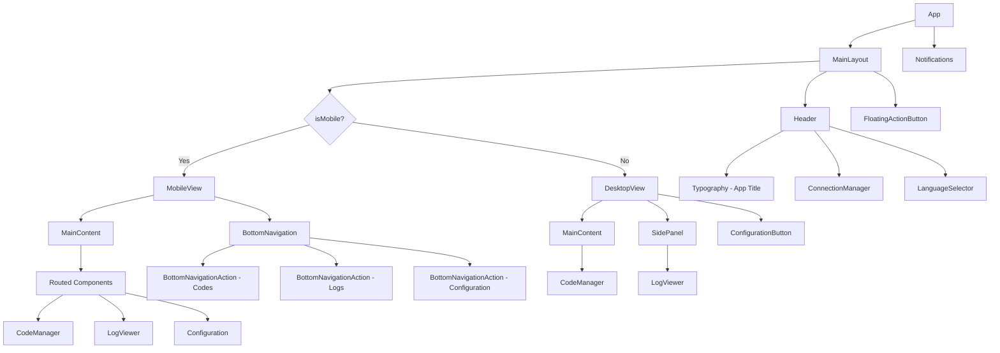

# Boks Web BLE - Architecture Document

## Overview

This document describes the architecture of the refactored Boks Web BLE application, which implements responsive layouts for both mobile and desktop views with improved UI/UX.

## Current Architecture

The current application has a simple structure with:

- A single App component that manages the entire layout
- Fixed header with app title, connection manager, and language selector
- Two-column grid layout for code management and logs when connected
- Floating action button for adding codes
- Notification system

## Proposed Architecture

### Component Structure

### Key Components

#### MainLayout

The root layout component that handles responsive behavior:

- Uses `useMediaQuery` to detect screen size
- Conditionally renders MobileView or DesktopView
- Manages global layout structure

#### Header

Consistent header across both views:

- App title
- ConnectionManager with integrated battery indicator
- LanguageSelector

#### MobileView

Mobile-specific implementation:

- BottomNavigation with three tabs (Codes, Logs, Configuration)
- Tab-based routing for main content
- Accordion organization for codes

#### DesktopView

Desktop-specific implementation:

- Split view with main content and side panel
- Configuration modal accessible via header button
- Persistent layout elements

#### Shared Components

- **ConnectionManager**: Handles Bluetooth connection and displays battery level
- **CodeManager**: Manages code creation, listing, and deletion
- **LogViewer**: Displays device logs
- **FloatingActionButton**: Triggers code creation dialog

### Data Flow

1. **State Management**
   - Global state managed through existing hooks (useBLE, useLocalStorage)
   - Component-specific state managed with useState
   - No additional state management library required

2. **Event Handling**
   - Parent components pass callback functions to child components
   - Child components call these callbacks to communicate changes
   - Unidirectional data flow maintained

### Responsive Design

#### Breakpoints

- Mobile: Screen width ≤ 768px
- Desktop: Screen width > 768px

#### Implementation

- Material-UI's `useMediaQuery` with theme breakpoints
- Conditional rendering based on screen size
- Responsive spacing and typography

### UI/UX Improvements

#### Connect Button

- Text changed from "Se connecter à l'appareil" to "Se connecter"
- Color updated to differentiate from header

#### Mobile Layout

- Bottom navigation with three tabs
- Accordion organization for codes (Permanent, Single Use)
- Tab-based content switching

#### Desktop Layout

- Main content area for code management
- Side panel for logs
- Configuration modal accessible via header button

#### Code Management

- Floating Action Button (+) in bottom right for code creation
- Accordion organization for mobile view

#### Header

- Integrated battery level icon
- Consistent across both views

## Implementation Plan

### Phase 1: Foundation

1. Create MainLayout component with responsive detection
2. Refactor ConnectionManager to integrate battery indicator
3. Create Header component

### Phase 2: Mobile Implementation

4. Create MobileView with bottom navigation
5. Implement tab-based routing
6. Update CodeManager with accordion organization

### Phase 3: Desktop Implementation

7. Create DesktopView with side panel
8. Implement configuration modal
9. Set up main content area

### Phase 4: UI Enhancements

10. Implement FloatingActionButton
11. Update styling for consistency
12. Ensure proper spacing and typography

### Phase 5: Testing

13. Test responsive behavior across screen sizes
14. Verify functionality on target browsers
15. Conduct accessibility review

## Files to be Created

1. `src/components/layout/MainLayout.jsx` - Main layout wrapper
2. `src/components/layout/Header.jsx` - Header component
3. `src/components/layout/MobileView.jsx` - Mobile-specific layout
4. `src/components/layout/DesktopView.jsx` - Desktop-specific layout
5. `src/components/ConfigurationModal.jsx` - Settings modal
6. `src/components/FloatingActionButton.jsx` - FAB component

## Files to be Modified

1. `src/app.jsx` - Simplify to use new layout components
2. `src/components/ConnectionManager.jsx` - Update button text/styling, integrate battery indicator
3. `src/components/CodeManager.jsx` - Add accordion organization for mobile
4. `src/theme.js` - Potentially adjust theme if needed

## Benefits of the New Architecture

1. **Improved User Experience**
   - Tailored layouts for mobile and desktop
   - Intuitive navigation patterns
   - Clear visual hierarchy

2. **Better Maintainability**
   - Modular component structure
   - Separation of concerns
   - Easier to extend and modify

3. **Enhanced Responsiveness**
   - Properly adapted layouts for different screen sizes
   - Consistent behavior across devices
   - Improved touch target sizing

4. **Accessibility**
   - Proper ARIA attributes
   - Keyboard navigation support
   - Sufficient color contrast

## Risk Mitigation

1. **Backward Compatibility**
   - Maintain existing functionality during refactoring
   - Thorough testing before deployment

2. **Performance**
   - Optimize component structure
   - Avoid unnecessary re-renders

3. **Browser Compatibility**
   - Test on target browsers
   - Ensure Web BLE functionality remains intact

4. **User Experience**
   - Maintain familiar workflows where possible
   - Provide clear visual feedback
