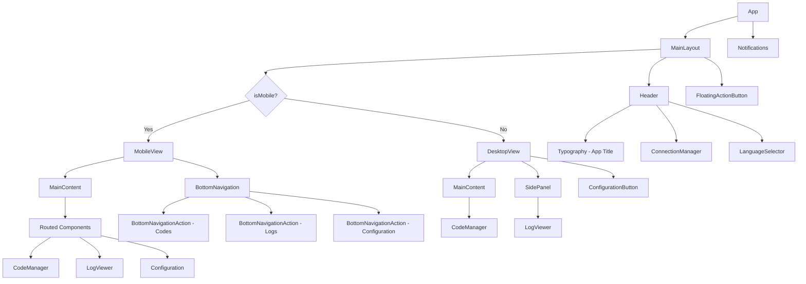

# Component Hierarchy

## Overview

This document describes the component hierarchy for the new responsive layout of the Boks Web BLE application.

## Root Structure

## Detailed Component Structure

### Main Components

1. **App**
   - Root component that renders the entire application
   - Sets up theme and BLE context providers

2. **MainLayout**
   - Wrapper component that handles responsive layout switching
   - Uses `useMediaQuery` to determine screen size
   - Renders either MobileView or DesktopView

3. **Header (AppBar)**
   - Contains app title, connection manager, and language selector
   - Consistent across both mobile and desktop views
   - Battery indicator integrated into ConnectionManager

4. **MobileView**
   - Tab-based navigation using BottomNavigation
   - Main content area that switches based on active tab
   - Components:
     - MainContent (renders CodeManager, LogViewer, or Configuration based on active tab)
     - BottomNavigation (with Codes, Logs, Configuration tabs)

5. **DesktopView**
   - Split view with main content and side panel
   - Configuration accessible via button in header
   - Components:
     - MainContent (always shows CodeManager)
     - SidePanel (always shows LogViewer)
     - ConfigurationButton (opens ConfigurationModal)

6. **FloatingActionButton**
   - Positioned in bottom right corner
   - Only visible when connected to a device
   - Triggers code creation dialog

### Shared Components

1. **ConnectionManager**
   - Shows connection status and controls
   - Displays battery level when connected
   - Moved battery indicator from separate display to header

2. **CodeManager**
   - Manages code creation, listing, and deletion
   - Will be updated with accordions for mobile view
   - FAB integration for quick code creation

3. **LogViewer**
   - Displays device logs
   - Will be in side panel on desktop, tab on mobile

4. **Configuration**
   - Settings and configuration options
   - Modal dialog accessible from both views
   - Will be implemented as a separate component

### New Components to Create

1. **MainLayout.jsx**
   - Wrapper component for responsive layout
   - Implements screen size detection

2. **MobileView.jsx**
   - Mobile-specific layout with bottom navigation
   - Tab routing implementation

3. **DesktopView.jsx**
   - Desktop-specific layout with side panel
   - Configuration modal integration

4. **Header.jsx**
   - AppBar with title, connection manager, and language selector
   - Consistent across both views

5. **ConfigurationModal.jsx**
   - Modal dialog for settings
   - Accessible from both mobile and desktop views
